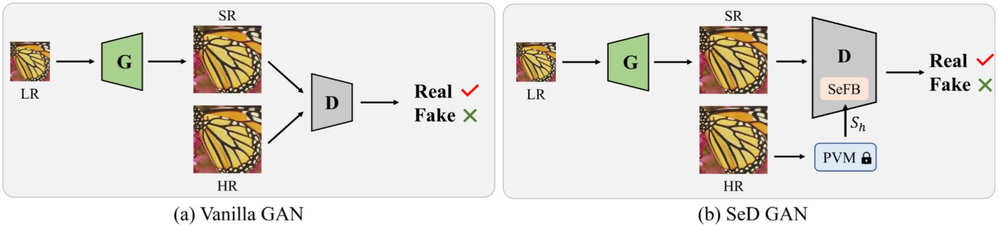
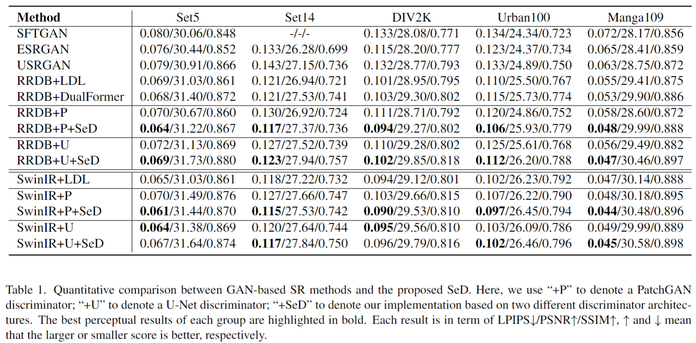
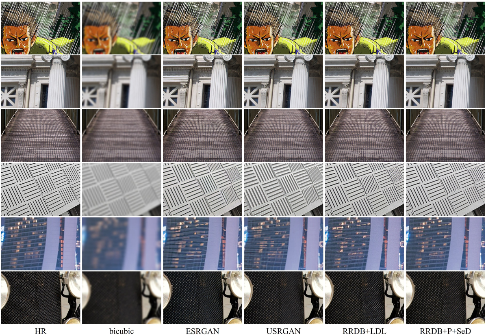

<p align="center">
  
</p>

# Semantic-Aware Discriminator for Image Super-Resolution

[](https://arxiv.org/pdf/2402.19387.pdf)

This repository is the official PyTorch implementation of SeD: Semantic-Aware Discriminator for Image Super-Resolution (CVPR24)

## :bookmark: News!!!
- [x] 2024--: **Updated xx on 15/09/2024 in this GitHub.**
- [ ] 2024--: **Updated xx on 15/09/2024 in this GitHub.**
---

> Generative Adversarial Networks (GANs) have been widely used to recover vivid textures in image super-resolution (SR) tasks. In particular, one discriminator is utilized to enable the SR network to learn the distribution of real-world high-quality images in an adversarial training manner. However, the distribution learning is overly coarse-grained, which is susceptible to virtual textures and causes counter-intuitive generation results. To mitigate this, we propose the simple and effective Semantic-aware Discriminator (denoted as SeD), which encourages the SR network to learn the fine-grained distributions by introducing the semantics of images as a condition. Concretely, we aim to excavate the semantics of images from a well-trained semantic extractor. Under different semantics, the discriminator is able to distinguish the real-fake images individually and adaptively, which guides the SR network to learn the more fine-grained semantic-aware textures. To obtain accurate and abundant semantics, we take full advantage of recently popular pretrained vision models (PVMs) with extensive datasets, and then incorporate its semantic features into the discriminator through a well-designed spatial cross-attention module. In this way, our proposed semantic-aware discriminator empowered the SR network to produce more photo-realistic and pleasing images. Extensive experiments on two typical tasks, i.e., SR and Real SR have demonstrated the effectiveness of our proposed methods.


<p align="center">
  
</p>

## :sparkles: Getting Start
### Preparing Environment

Python == 3.9 \
Pytorch == 1.9.0

```bash
conda create -n SeD python=3.9
conda activate SeD
pip install torch==1.9.0+cu111 torchvision==0.10.0+cu111 torchaudio==0.9.0 -f https://download.pytorch.org/whl/torch_stable.html
pip install -r requirements.txt
pip install git+https://github.com/openai/CLIP.git
```

Notes: To install Pytorch 1.9.0, you may also refer to the [official site](https://pytorch.org/get-started/previous-versions/).

### Preparing Training Data

* Download DIV2K: Following this link: [DIV2K](http://data.vision.ee.ethz.ch/cvl/DIV2K/DIV2K_train_HR.zip)
* Download Flickr2K: Following this link: [Flickr2K](https://cv.snu.ac.kr/research/EDSR/Flickr2K.tar)
* Make a directory with name **DF2K**. Move GT images from DIV2K and Flickr2K into **train** folder under **DF2K**. Move x4 downsampled images into **train_x4** folder under **DF2K**. Now your dicrectory should look like:
```
DF2K
|-train
|---0001.png
|---000001.png
|---...
|-train_x4
|---0001x4.png
|---000001x4.png
|---...
```
* Run (Please replace N with a suitable thread numbers for your operation system, e.g., 12)
```
python extract_subimages.py --input DF2K/train --output DF2K/train_sub --n_thread N
python extract_subimages.py --input DF2K/train_x4 --output DF2K/train_sub_x4 --n_thread N --crop_size 120 --step 60
```
* Now we have **train_sub** and **train_sub_x4** folders under **DF2K**, these two folders will be used for training.

### Preparing Evaluation Data
* Download Set5, Set14, Urban100, Manga109: Following this link: [download all](https://drive.google.com/drive/folders/1B3DJGQKB6eNdwuQIhdskA64qUuVKLZ9u)
* Unzip them into **Evaluation**. Now your dicrectory should look like:
```
Evaluation
|-Set5
|---GTmod12
|---LRbicx2
|---LRbicx3
|---LRbicx4
|-Set14
|-Urban100
|-...
```

## :sparkles: Training
### Download Pretrained PSNR-oriented Weights
* RRDB: [RRDB.pth](https://github.com/cszn/KAIR/releases/download/v1.0/RRDB.pth)
* SwinIR: [SwinIR.pth](https://github.com/JingyunLiang/SwinIR/releases/download/v0.0/001_classicalSR_DF2K_s64w8_SwinIR-M_x4.pth)

Notes: please put them into **pretrained** folder.
### Start Training
```bash
CUDA_VISIBLE_DEVICES=0,1,2,3 python -m torch.distributed.launch --nproc_per_node=4 train.py --opt options/train_rrdb_P+SeD.yml --resume pretrained/RRDB.pth
```

Notes: you may also alter the additional argparse:
```bash
--data_root /path/to/your/DF2K
--out_root /path/to/your/checkpoints
```
## Results
Quantitative Results
<p align="center">
  
</p>
Visual Comparisons
<p align="center">
  
</p>

## Citation
Please cite us if this work is helpful to you.
```
@inproceedings{li2024sed,
  title={SeD: Semantic-Aware Discriminator for Image Super-Resolution},
  author={Li, Bingchen and Li, Xin and Zhu, Hanxin and Jin, Yeying and Feng, Ruoyu and Zhang, Zhizheng and Chen, Zhibo},
  booktitle={Proceedings of the IEEE/CVF Conference on Computer Vision and Pattern Recognition},
  year={2024}
}
```

## Acknowledgments
The code is partially from the below repos.
* [KAIR](https://github.com/cszn/KAIR)
* [Real-ESRGAN](https://github.com/xinntao/Real-ESRGAN/tree/master)
* [SwinIR](https://github.com/JingyunLiang/SwinIR/tree/main)
* [CLIP](https://github.com/openai/CLIP)

Please follow their licenses. Thanks for their awesome works.
